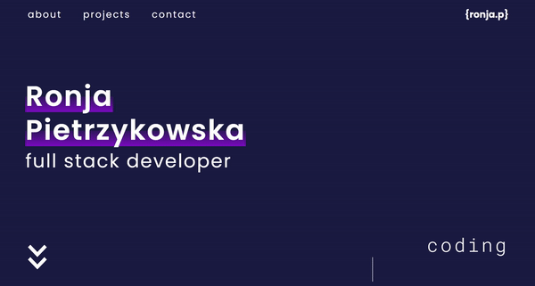

# 100 Days Of Code - Log

### Day 1: February 28, 2022

**Today's Topic**: CSS Animations

- Streamed my progress on Twitch
- Completed freeCodeCamp lessons on CSS animations
- Followed YouTube tutorials for typewriter animations
- Worked with keyframes rules, variables and pseudo elements
- Added working typewriter animation to my portfolio website

**Thoughts:** I struggled to apply the tutorial in my existing project while streaming and needed time to myself to rethink my approach. In the end I couldn't complete my original ambitious idea but I still found a way to implement it that felt satisfying.

**Links to work:**

1. [freeCodeCamp CSS Animation lessons](https://www.freecodecamp.org/learn/2022/responsive-web-design/learn-css-animation-by-building-a-ferris-wheel/step-1)
2. [Typewriter Animation Tutorial](https://youtu.be/w1nhwUGsG6M)
3. [Portfolio Project commit](https://github.com/ronja-p/portfolio/commit/0094c188ef8c624597ccb8579332fdf57326f9f9)

